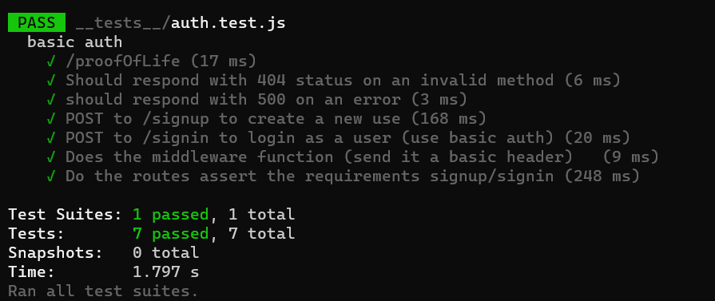

# basic-auth

## Author: Dima Alabsi

## Setup
 .env requirements
* PORT = 8080
## Running the app

* npm run dev

* Endpoint:  **/status** 

    * Returns Object

{

  ***"status": "running",***

  ***"port": 8080***

}

## Tests

* Unit Tests: **npm run test**

## Run

***npm run dev***

## Heroku applications 

*   [main branch](https://dimaalabsibasic-api-server.herokuapp.com/)  
dimaalabsibasic-api-server.herokuapp.com/

## Github actions

*    [actions](https://github.com/DimaAlabsi/basic-auth/actions)      

## pull request

* [last pull request](https://github.com/DimaAlabsi/basic-auth/pull/1)

# dependencies 💯

base-64
bcrypt
cors
dotenv
express
pg
sequelize
sequelize-cli
sqlite3
jest
supertest
    

## UML

